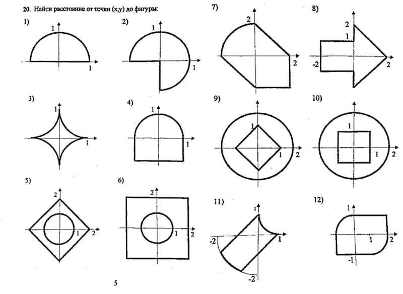

# Аудиторные практики

1. Дана начальная и конечная клетки на шахматной доске. Корректный ли это ход на пустой доске для: 
слона, коня, ладьи, ферзя, короля?

	Разобраться с булевыми выражениями. Ответы должны быть примерно такими:

	|dx| == |dy|, dx == 0 || dy == 0, |dx| + |dy| == 3 && (|dx| > 0 || |dy| > 0), ...

2. Пролезет ли брус со сторонами x, y, z в отверстие со сторонами a, b, 
	если его разрешается поворачивать на 90 градусов?

	Догадаться использовать упорядочение x, y, z и a, b.

	На предыдущих примерах нужно обсудить, что алгоритмы могут быть красивые (краткие, понятные, ...) 
	и некрасивые (длинные, трудно проверяемые).

3. __ДЗ.__ Пересечение двух отрезков [A,B] и [C,D] на числовой прямой. Опять же — найти красивое решение. 
	Альтернативная формулировка — минимизировать количество сравнений.

	В результате ожидаем что-то вроде Max(A, C) <= Min(B, D)

4. Расстояние от хитрой фигуры до точки. Фигуру выбрать по вкусу:

	

	Обсудить как правильно использовать разные типы симметрии фигуры.
	Разобрать в классе не менее 2 задач + 1 дать на __ДЗ__.

5. __ДОП__ Заданы координаты трех точек на плоскости. Являются ли они вершинами квадрата? 
	Если да, то найти координаты четвертой вершины.

6. __ДЗ.__ (сложная) Определить, какое максимальное количество прямоугольников размера 1 * K можно разместить на поле размера N * M.
	Задача решается одним сравнением двух формул на основе делимости.

# Компьютерные практики

При приеме задач этого блока важно требовать, чтобы код не был сплошным нагромождением условий и непонятных булевых выражений.

Код должен быть понятен и читаем. Повторяющиеся участки кода должны быть выделены во вспомогательные методы или переменные с понятными именами.

Особенно это касается задачи с расстоянием до фигуры — в ней код студентов имеет тенденцию превращаться в фарш, а должно быть что-то в духе:

	double GetDistanceToCurve(double x, double y)
	{
		if (x < 0) return GetDistanceToCurve(-x, y);
		var d1 = DistaceToDiagonalSegment(x, y);
		var d2 = DistaceToVerticalSegment(x, y);
		var d3 = DistaceToArc(x, y);
		return Math.Min(d1, Math.Min(d2, d3));
	}

В задаче про котиков и лайки подразумевается решение в духе

	string Pluralize(int count, string one, string two, string five)

	Pluralize(1, "котик", "котика", "котиков");
	Pluralize(3, "кофе", "кофе", "кофе");
	Pluralize(11, "ошибка", "ошибки", "ошибок");
